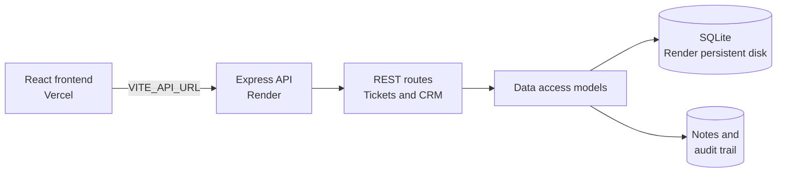

# DataStraw CRM

DataStraw CRM is a small, end-to-end customer support workspace for tickets, customers, orders, and team collaboration.

## Submission Links

- Frontend: `Not deployed yet - add the public Vercel URL here.`
- Backend/API: `Not deployed yet - add the public Render URL here.`
- API health check: `<backend-url>/api/health`
- GitHub: https://github.com/pratikdongare12/datastraw-crm
- Demo video: `Not recorded yet - add the YouTube or equivalent URL here.`

The deployment URL fields are intentionally explicit because this repository does not contain published Vercel, Render, or video URLs. Replace them before submission.

## Features

- Create, search, filter, update, and delete support tickets.
- Search by ticket ID, customer, email, subject, and description.
- Add persistent internal support notes to tickets.
- Automatically record status changes in the ticket timeline as system notes.
- Manage customers with company, phone, service tier, and ticket counts.
- Track customer orders with status, amount, and customer context.
- Manage team members with online, away, and offline presence.
- Post shared team activity updates.
- Validate request types and email addresses at the API boundary.
- Prevent stale search responses with abortable frontend requests.

## Architecture



The application is intentionally a small monolith for the assignment. It does not use authentication, AI features, microservices, or a complex service layer. SQLite is appropriate for this demonstration because the Render configuration provisions persistent storage. For a larger production workload, the database boundary can move to PostgreSQL without changing the frontend API contract.

### Supabase/PostgreSQL migration path

The production schema is also available in [supabase/schema.sql](supabase/schema.sql). It preserves the current API status values (`open`, `in_progress`, and `resolved`) while adding PostgreSQL-managed ticket IDs, timestamps, indexes, row-level security, and the same transactional status audit trail through database triggers. Apply it in the Supabase SQL Editor before switching the API database adapter from SQLite to Supabase.

```text
frontend/src/
├── App.jsx
├── components/
│   ├── TicketFormManaged.jsx
│   ├── TicketList.jsx
│   ├── TicketDetailManaged.jsx
│   └── CrmPanels.jsx
└── styles.css

backend/
├── routes/
│   ├── tickets.js
│   └── crm.js
├── models/
│   ├── ticketModel.js
│   └── crmModel.js
├── test/
│   └── tickets.test.js
├── db.js
└── index.js
```

## Ticket Statuses

The database and API use these canonical values:

- `open` - displayed as **Open**
- `in_progress` - displayed as **In progress**
- `resolved` - displayed as **Closed** in the UI

The UI label **Closed** intentionally maps to the API/database value `resolved`; the stored status is not renamed.

## Support Notes

Notes are stored in the `notes` table with a foreign key to `tickets.id`. `GET /api/tickets/:id` includes the ticket's notes, so they remain visible after a page refresh. SQLite foreign keys are enabled and the relationship uses `ON DELETE CASCADE`, so deleting a ticket also deletes its notes.

Status changes append a `[System]` note in the same database transaction as the ticket update. This creates a lightweight audit trail without adding another table or changing the API contract.

## API Endpoints

### System and tickets

- `GET /api/health`
- `GET /api/tickets?status=open&search=customer`
- `GET /api/tickets/:id`
- `POST /api/tickets`
- `PUT /api/tickets/:id`
- `PATCH /api/tickets/:id`
- `DELETE /api/tickets/:id`

Ticket updates accept fields such as `{ status, priority, description, notes }`.

### CRM resources

- `GET /api/summary`
- `GET/POST /api/customers`
- `GET/POST /api/orders`
- `GET/POST /api/team`
- `GET/POST /api/activities`

## Environment Variables

### Backend local setup

Create `backend/.env` from the committed example:

```powershell
Copy-Item backend/.env.example backend/.env
```

Backend variables:

```env
PORT=4000
FRONTEND_ORIGIN=http://localhost:5173
DB_PATH=./tickets.db
```

Frontend variable:

```env
VITE_API_URL=http://localhost:4000/api
```

For production, configure these values in the hosting dashboards rather than committing secrets:

| Service | Variable | Example |
| --- | --- | --- |
| Render | `FRONTEND_ORIGIN` | `https://your-crm.vercel.app` |
| Render | `DB_PATH` | `/opt/render/project/src/backend/data/tickets.db` |
| Vercel | `VITE_API_URL` | `https://your-api.onrender.com/api` |

The committed `render.yaml` supplies `DB_PATH` and `NODE_VERSION`; set the frontend origin in Render and the API URL in Vercel after both services are deployed.

## Local Setup

From the repository root:

```powershell
npm install --prefix backend
npm install --prefix frontend
npm test --prefix backend
npm run build --prefix frontend
```

Start the services in separate terminals:

```powershell
npm run dev:backend
npm run dev:frontend
```

Open `http://localhost:5173` and verify the API at `http://localhost:4000/api/health`.

## Deployment

### Backend on Render

The root `render.yaml` uses `backend` as the service directory, runs `npm install`, starts with `npm start`, and provisions a 1 GB persistent disk mounted at `/opt/render/project/src/backend/data`. Set `FRONTEND_ORIGIN` to the Vercel URL in the Render service environment.

### Frontend on Vercel

Set the project root to `frontend`, use the existing `vercel.json`, and configure `VITE_API_URL` in Vercel to the Render API URL plus `/api`. The frontend build command is `npm run build` and output directory is `dist`.

## Pre-submission Checklist

- [ ] Create a ticket.
- [ ] Search by customer, email, subject, and description.
- [ ] Filter by Open, In Progress, and Closed.
- [ ] Open ticket details.
- [ ] Update the ticket status.
- [ ] Add a support note.
- [ ] Refresh the page and confirm the note remains.
- [ ] Delete the ticket.
- [ ] Confirm `/api/health` returns `{ "status": "ok" }`.
- [ ] Confirm the production frontend can reach the production backend.
- [ ] Run `npm test --prefix backend`.
- [ ] Run `npm run build --prefix frontend`.

## Demo Video Outline

Keep the demo between three and four minutes:

1. Show the deployed workspace, create a ticket, search for it while typing, filter by status, and open its detail view.
2. Update the ticket to **In progress** or **Closed**, add a support note, and refresh the detail view to show persistence.
3. Briefly walk through `backend/routes/tickets.js`, `backend/models/ticketModel.js`, and `backend/db.js` to explain the API, validation, and relational schema.
4. Explain the audit trail: status updates write the ticket change and `[System]` note in one transaction. The tradeoff is one additional write per status change, exchanged for accountable history and rollback safety.

For a Supabase/PostgreSQL deployment, show [supabase/schema.sql](supabase/schema.sql) and explain that the database trigger moves the same audit guarantee closer to the data.

## Development Notes

The backend uses Express, `better-sqlite3`, and normalized SQLite tables for tickets, notes, customers, orders, team members, and activities. The frontend uses React and Vite with focused components rather than a custom hook abstraction layer.
